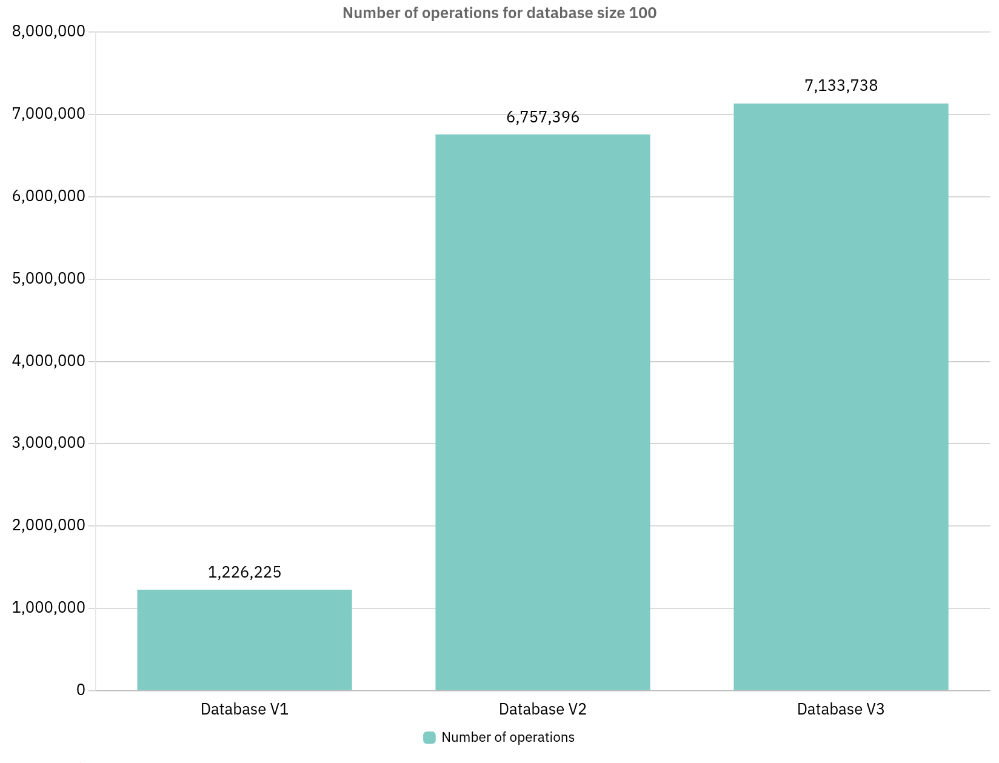
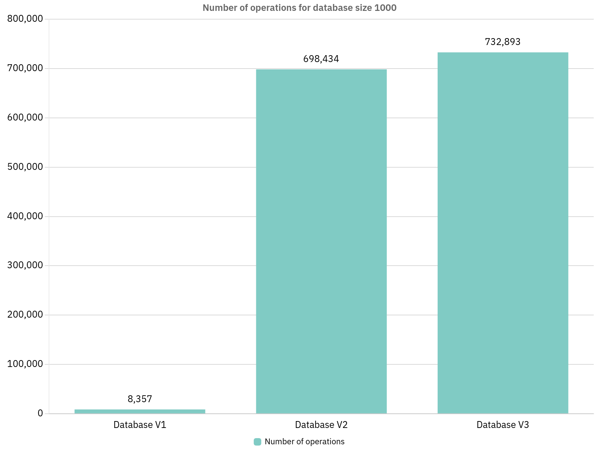
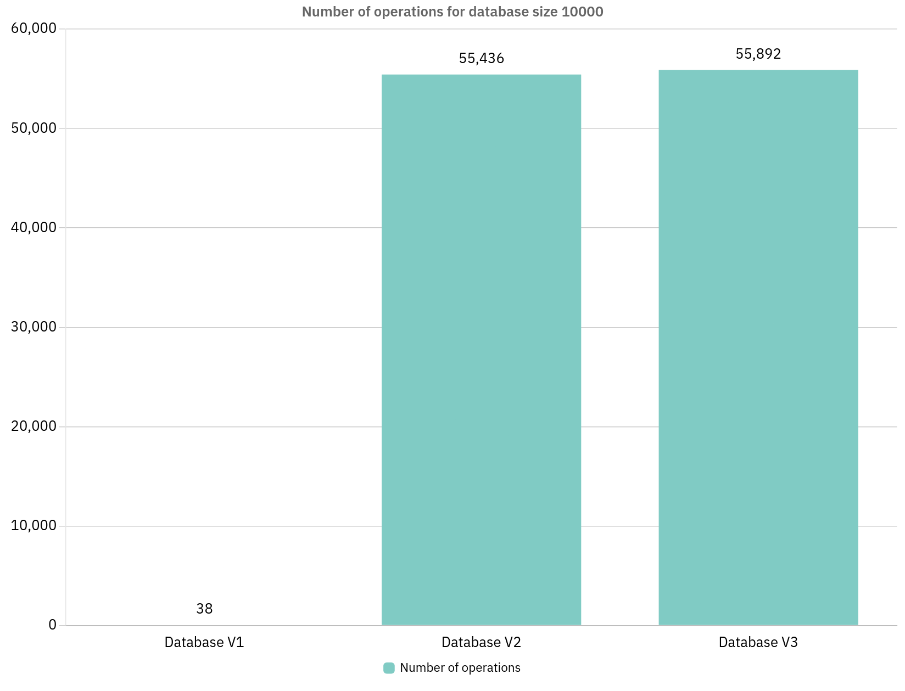
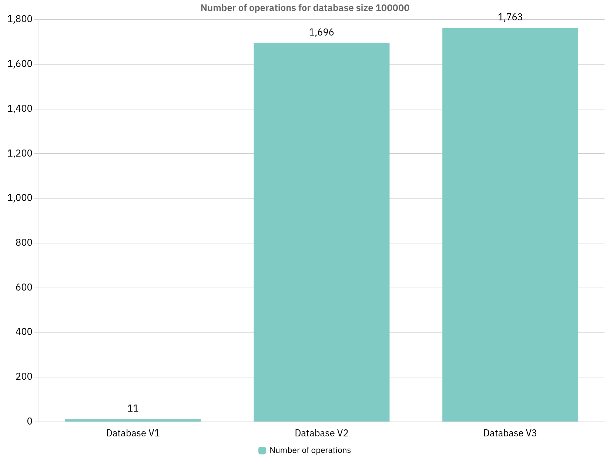
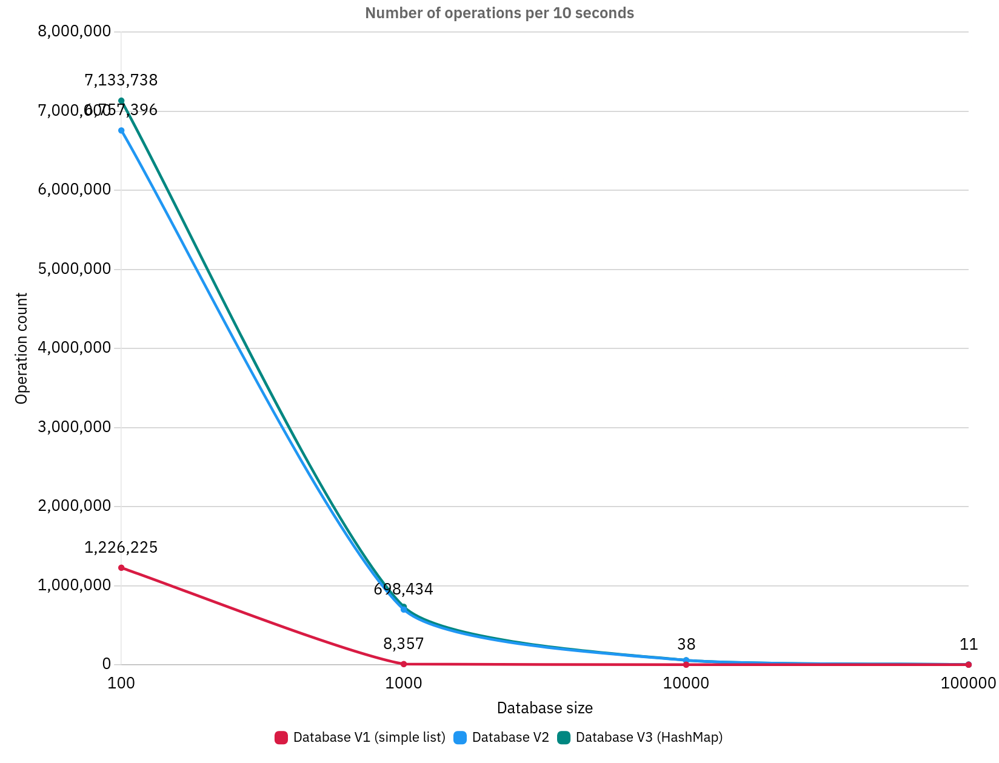
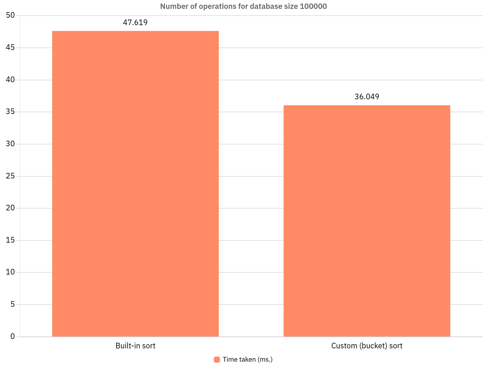

# Homework 1

Author: Kyrylo Omelianchuk\
Variant: **V1**, A:10, B:10, C:1, **S6**

## Chosen database containers

V1: A simple unsorted list.

V2: One hash map with keys of `name + surname`. Operation 3 is unoptimized, using only values from the hashmap. Effectively works the same as with a list.

V3: Two hash maps - one with keys of `name + surname` and one with keys of `email`, for optimizing operation 3 to constant time.

## Measurements

All data taken from `Main.java`. Results might differ due to JVM.

## Measured number of operations over 10 second period

## Space complexity

Java does not provide tools for measuring memory used by objects in heap. We can only make estimations, such as that a HashMap will take more space than a List (because it also must store hash) and two HashMaps will definitely take up more space than a single one. 

## Best database (?)

Ultimately, the choice between Database V2 and Database V3 falls to the priorities. If speed has greater priority, Database V3 allows for great optimization of operation 3, reducing its time complexity from O(N) to constant time. But the downside is that it takes nearly twice as much memory, and for my specific case, where operation 3 is executed relatively rarely, using a single hash map in Database V2 can be a better choice.

## Sorting comparisons

I compared built-in `Collections.sort` and a custom sorting algorithm, for which I have chosen bucket sort. Since the task is to sort by birth month and then by birth day, we can create 12 buckets, one for each month, put each student into a bucket corresponding to their birth month, and then sort the buckets individually, by birth day. The time complexity of such algorithm is O(N), while `Collections.sort` takes O(N log N) time. The results can be seen in the chart below.

